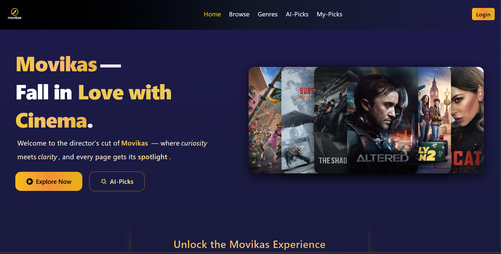
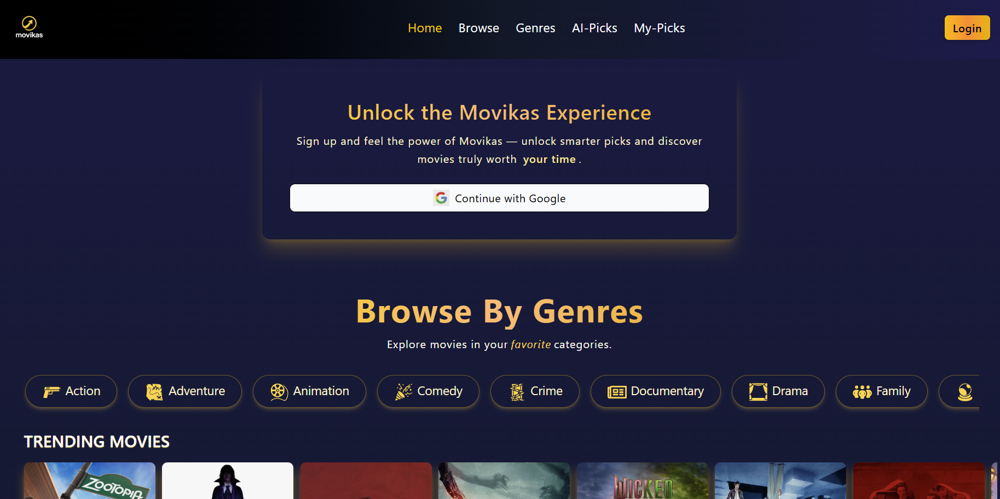
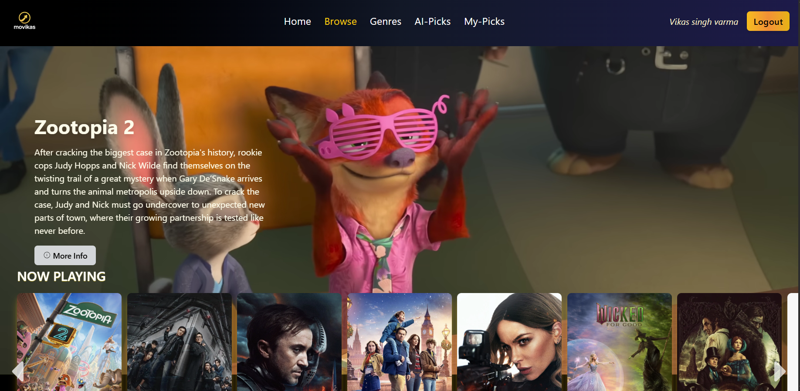
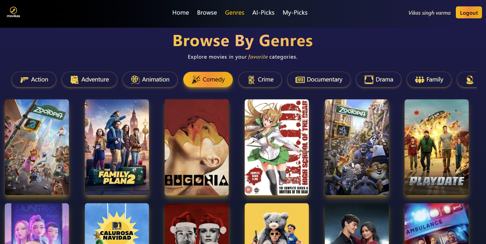
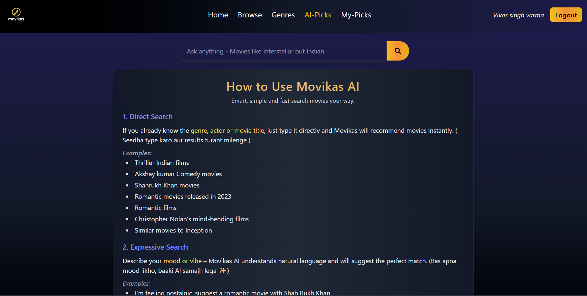
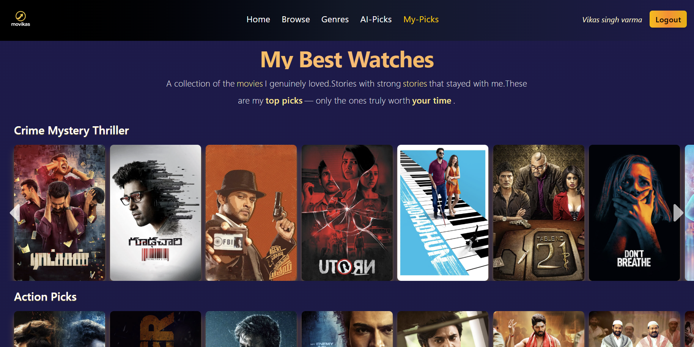
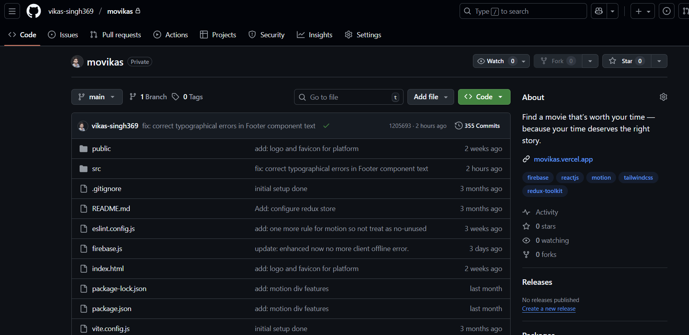
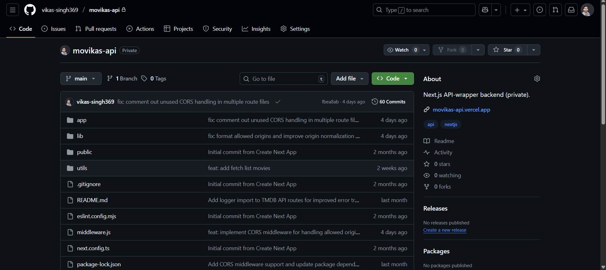

# Movikas — [Live Demo](https://www.movikas.in)

This repository is the public showcase of **Movikas** — covering product details, features, tech stack, and architecture highlights.  

**Note :** The actual production code for both the frontend and the API-wrapper backend (movikas-api) remains private.

## ❗Problem 
Users waste too much time deciding what to watch. They jump between apps, reviews, and platforms just to find a movie that matches their mood or availability.

## 📌 Solution 

Movikas helps users discover the right movie instantly with clean search, real-time details, accurate OTT availability, AI-powered recommendations based on whatever you write or want, and a personal handpicked collection curated by me.

**Find a movie that's worth your time. Movikas helps you discover the right story based on what you want to watch — because your time deserves the perfect film.**

## Features

* Browse a wide range of collections — including Now Playing, Trending (Day & Week), Upcoming, Popular, Top-Rated, and India-specific movies across 7–8 regional languages.

* Enjoy a fast, responsive, and smooth UI, designed for a seamless browsing experience.

* Genre-based browsing with infinite scroll and shimmer-loading placeholders for a fluid discovery experience.

* Movie detail pages with ratings, overview, trailers, similar movie suggestions, and a “You Might Also Like” curated list.

* Movikas AI Search lets you discover movies using prompts in your regional language, English, or Hinglish. It provides personalized suggestions based on your text input and shows detailed information when available.

* One-tap Google Login for fast and secure user authentication.

* Explore movies with detaisl info, watch the trailer, and enjoy the film anywhere — every movie in this handpicked list is personally selected and recommended by me.

* Custom API-wrapper backend for secure and optimized TMDb requests.

* Graceful error-handling for API failures, rate limits, and network issues.

* Fully responsive design, optimized for all screen sizes and devices.

## 🖼️ Screenshots

<table>
  <tr>
    <td></td>
    <td></td>
  </tr>
  <tr>
    <td></td>
    <td></td>
  </tr>
  <tr>
  <td></td>
  <td></td>
  </tr>
  <tr>
  <td></td>
  <td></td>
  </tr>
</table>

## Tech Stack 🧑‍💻

**Frontend**
* React
* React Router
* Redux Toolkit
* motion/react (animations)
* Tailwind CSS
* Google GenAI (AI-powered search)
* Firebase (Auth + lightweight data usage)

**Authentication**
* Firebase Auth — Google Sign-In

**Data / Configuration**
* Firestore — used only for essential configuration and important data fetch

**Backend (API-wrapper)**
* Next.js (API Routes)

* Custom TMDb request handler for secure and optimized API calls

**External API**
* TMDb API (The Movie Database)

**Deployment**
* Vercel — both frontend and API-wrapper deployed on Vercel

## Private Repository Activity (Snapshot)

<table>
<tr>
<td></td>
  <td></td>
</tr>
</table>

## 🧱 Architecture Overview

React Frontend → Next.js API-wrapper → TMDb API  
React Frontend ← Next.js API-wrapper ← TMDb API

## 🗺️ Future Roadmap

* Movikas will continue to evolve based on user feedback.

* I’ll explore new ideas and add improvements whenever needed to enhance the overall experience.

## 📄 Attribution

This product uses the TMDb API but is not endorsed or certified by TMDb.

## 👤 About Me

I'm Vikas — a full-stack developer who loves building clean, fast, and meaningful products. Movikas is a side project created out of curiosity, learning, and genuine passion.

Explore more: https://namastedev.com/vikas_singh369

## 📬 Contact

* GitHub: https://github.com/vikas-singh369
* LinkedIn: https://www.linkedin.com/in/vikas-singh369
* Email: vikashverma3001@gmail.com
* X (Twitter): https://x.com/vikas_singh369
* Portfolio: https://namastedev.com/vikas_singh369
